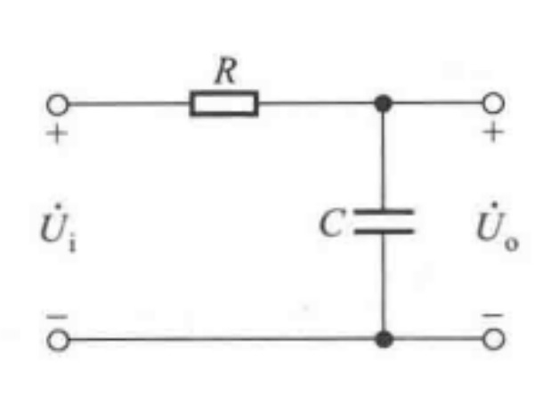
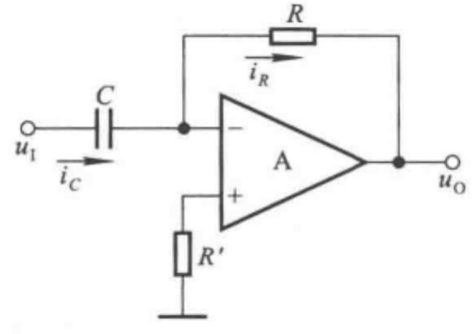
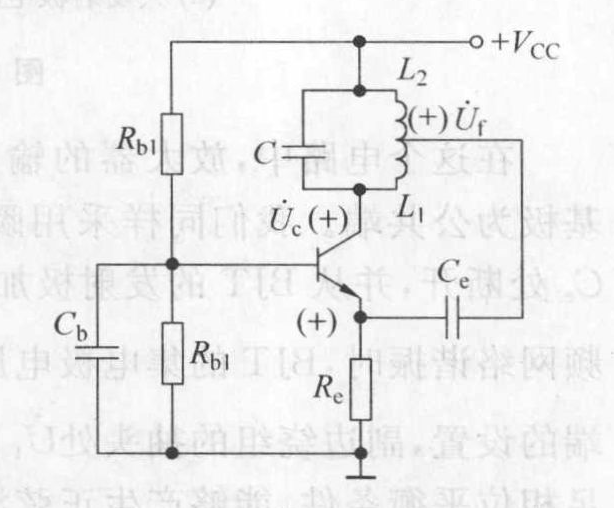
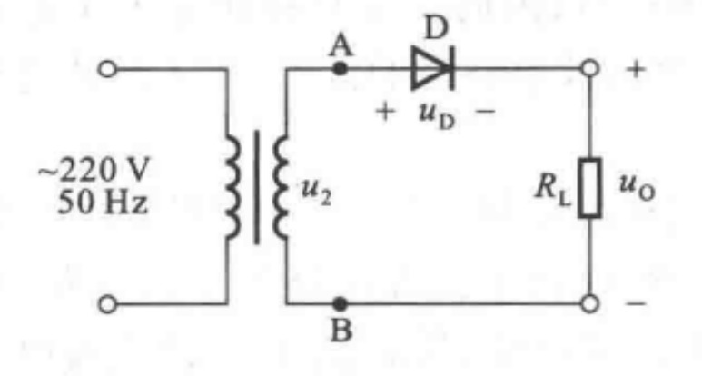

# 模拟电子技术基础

## 一、半导体器件基础

### 1.半导体材料

##### 1.1.本征半导体

纯净单一、不含杂质的半导体材料称为**本征半导体**。

在温度T=0K时，如果没有外界激发，硅原子的所有价电子都被共价键所束缚，不会形成自由电子，因此称为束缚电子。但半导体材料中的价电子受共价键的束缚力较小，易摆脱束缚，形成自由电子。这种现象称为**本征激发**。

##### 1.2.载流子

一个价电子在变为自由电子后，在共价键位置上留下了一个空位，这个空位称之为**空穴**。空穴是带正电荷的。

空穴是由本征激发形成的，它和自由电子总是成对出现，因此，半导体宏观上呈电中性。

<u>在半导体中，既有带负电荷的自由电子的运动，又有带正电荷的空穴的运动，两者都可以形成传导电流。</u>

**自由电子**和**空穴**都称为**载流子**。

##### 1.3.杂质半导体

在本征半导体材料中掺入微量的杂质元素，可以使它的导电性能发生明显变化，这样的半导体称为**杂质半导体**。

杂质半导体分为N型半导体和P型半导体

###### 1.3.1 N型半导体

在四价的硅中掺入五价的元素磷（或砷、锑等），则磷原子会代替原来晶格位置的硅原子。磷原子最外层有五个价电子，其中的四个价电子与周围的四个硅原子的价电子组成共价键。由于杂质元素磷可以提供自由电子，因而称为**施主杂质**。

这种半导体称为**N型半导体**，它的<u>自由电子的数量比空穴大得多</u>。其中的自由电子称为**多数载流子**，空穴称为**少数载流子**，整个半导体材料是电中性的。

###### 1.3.2 P型半导体

在四价的硅中掺入三价的元素硼（或镓、铟等），则硼原子会代替原来晶格位置的硅原子。硼原子最外层有三个价电子，其中的三个价电子与周围的四个硅原子组成共价键时缺少一个价电子，出现了一个空位。由于杂质元素硼可以接受自由电子，因而称为**受主杂质**。

这种半导体称为**P型半导体**，它的<u>空穴的数量比自由电子大得多</u>。其中的空穴称为**多数载流子**，自由电子称为**少数载流子**，整个半导体材料是电中性的。

### 2.PN结

##### 2.1.PN结的形成

采用一定的半导体制造工艺，将一块半导体材料一边做成P型半导体，一边做成N型半导体，两者之间的交界面附近形成了**PN结**。

在交界面的两边，载流子的浓度是不一样的。<u>在P区空穴浓度很大，在N区自由电子浓度很大</u>。由于两种载流子存在很大的浓度差，它们就要向对方的区域扩散，这种由浓度差引起的运动称为**扩散运动**。

扩散到对方区域的载流子会被对方复合掉，这样在交界面附近形成了没有任何种类载流子的区域。这个区域里只有正负离子，这个区域称为**空间电荷区**，又被称为**PN结**。

在这个区域中，载流子消耗已尽，所以又称为**耗尽区**。在P区一边只有阴离子，在N区一边只有正离子，其电荷量相等，这在耗尽区内形成了一个**内电场**，其方向由N区指向P区。

内电场是由多数载流子的扩散运动形成的。内电场建立后，对载流子的运动产生了两种不同影响。

- 对多数载流子的扩散运动，内电场起到阻碍作用
- 对少数载流子的漂移运动，内电场起到促进作用

少数载流子会在电场的作用下向对方区域运动，这种运动叫做**漂移运动**。

##### 2.2.PN结的单向导电性

如果PN结外接电压后，将会呈现出单向导电性。

###### 2.2.1 PN结加正向电压

当外加直流电压的正极接P区，负极接N区时，我们说PN结加了正向电压，称为**正向偏置**，或**正偏**。

这时外加电场与内电场的极性相反。<u>在外加电场的作用下，N区中的多数载流子电子和P区中的多数载流子空穴将会向对方区域运动。</u>

进入空间电荷区时，N区的多数载流子电子会和正离子中和，P区的空穴也会和负离子中和，这使得空间电荷区的正负离子数量变少，使<u>PN结变薄，内电场减弱</u>。

<u>内电场减弱使得多数载流子的扩散运动大大增强，扩散电流大大增加。</u>

外加正向电压后，少数载流子漂移形成的漂移电流很小。因此主要是扩散电流流过PN结，称为**正向电流**。

###### 2.2.2 PN结加反向电压

当外加直流电压的正极接N区，负极接P区时，我们说PN结外加反向电压，称为**反向偏置**，或**反偏**。

这时外加电场与内电场的极性相同。在外加电场的吸引下，N区中的多数载流子电子和P区中的多数载流子空穴都将远离PN结，使得PN结中正负离子的数量增加，使<u>PN结变厚，内电场增强</u>。

<u>内电场增强使得多数载流子的扩散作用大大减弱，少数载流子的漂移作用增强，漂移电流占主导地位。</u>

漂移电流又称**反向电流**，其方向与扩散电流相反。

###### 2.2.3 单向导电性

PN结正偏时，将会通过较大的正向电流，其方向从P区流向N区，PN结的等效电阻很小。

PN结反偏时，只有很小的反向电流，其方向从N区流向P区，PN结的等效电阻很大。

<u>正向电流远大于反向电流，这就是PN结的**单向导电性**。</u>

### 3.半导体二级管

一个PN结加上电极和引线，再用外壳封装起来，就构成了半导体二极管。

#### 3.1.半导体二极管的特性曲线

第一象限是二极管的正向特性。

- 当二极管外加较小的正向电压时，正向电流几乎为0，可以认为二极管是不导通的。
- 当二极管正向导通后，外加电压稍有上升，电流即有很大增加。

二极管的外加电压达到一定值时，才有能抵消内电场的影响，有电流出现，视为导通状态。这个电压称为二极管的**门限电压**，也称为**死区电压**或**阈值电压**。一般硅二极管的死区电压为0.5V，锗二极管的死区电压为0.1V。

二极管的正向电压变化范围很小。

- 硅二极管的正向导通电压为`0.6~0.8V`，典型值可取**0.7V**
- 锗二极管的正向导通电压为`0.2~0.4V`，典型值可取**0.3V**

#### 3.2.稳压二极管

### 4.半导体三极管

半导体三极管，又称为双极型三极管（BJT）。

#### 4.1.BJT的结构

BJT是由三块两两不同的半导体材料构成的，中间的极性与两端的相反，有**NPN**型和**PNP**型两种。

BJT有三种工作区域：

- 发射区
- 基区
- 集电区

每个区域引出一个电极

- 发射极e
- 基极b
- 集电极c

有两个PN结，发射区和基区之间的是**发射结**，基区与集电区之间的是**集电结**。

BJT的工作状态与其两个PN结上加的电压有很大关系。当这两个PN结的偏置情况不同时，BJT可能工作于放大、饱和、截止状态。

#### 4.2.BJT的放大状态

<u>BJT工作于放大状态时，必须保证发射结正偏，集电结反偏。</u>

BJT的发射极接两组电源的公共端，这种接法称为共发射极接法。

- 发射极向基区注入电子
- 电子在基区中扩散与复合
- 集电区收集电子
- 集电区的空穴向基区漂移

#### 4.3.BJT的输出特性曲线

整个曲线分为三个部分：**饱和区**、**放大区**、**截止区**。

- 饱和区：管压降u~CE~很小，<u>发射结正偏、集电结正偏</u>。$u_{BE}>死区电压$且$u_{CE}<u_{BE}$。
- 截止区：位于I~B~=0那条曲线以下，发射结压降小于**死区电压**。<u>发射结反偏，集电结反偏</u>。此时BJT不导通，基极电流为0，集电极电流近似为0。
- 放大区：<u>发射结正偏，集电结反偏</u>。

正向导通的发射结两端电压近似为常量，硅管0.7V，锗管0.3V。

反偏的集电结其电压一般较大且不固定。

#### 4.4.共发射极电流放大系数

共发射极直流电流放大系数
$$
\overline{\text{β}}=\frac{I_C-I_{CEO}}{I_B}\approx\frac{I_C-I_{CEO}}{I_B}
$$

共发射极交流电流放大系数
$$
β=\frac{\Delta I_C}{\Delta I_B}
$$

共基极电流放大系数用$\alpha$表示，它与共发射极电流放大系数$\beta$的关系是
$$
\beta = \frac{\alpha}{1-\alpha}
$$

## 二、基本放大电路

### 1.放大电路的一般表示方法

能使幅度较小的电信号幅度大幅提高且其电压、电流随时间的规律不变的电路称为**放大电路**，或**放大器**。

放大电路的输出电压$\dot{U_o}$和输出电流$\dot{I_o}$不是由有源元件提供的，而是由电源直接提供。

放大电路具有几个指标来反映放大功能，包括

- 电压放大倍数$\dot{A_u}$，也称为电压增益，其满足$\dot{U_o}=\dot{A_u}\dot{U_i}$
- 电流放大倍数$\dot{A_i}$，也称为电流增益，其满足$\dot{I_o}=\dot{A_i}\dot{I_i}$
- 互阻放大倍数$\dot{A_r}$，也称为互阻增益，其满足$\dot{U_o}=\dot{A_r}\dot{I_i}$
- 互导放大倍数$\dot{A_g}$，也称为互导增益，其满足$\dot{I_o}=\dot{A_g}\dot{U_i}$

### 2.放大电路的性能指标

- 放大系数
- 输入电阻
- 输出电阻
- 通频带
- 最大不失真输出幅度
- 最大输出功率
- 非线性失真系数

#### 2.1.输入电阻

输入电阻$R_i$是衡量放大器**对信号源衰减程度**的指标，通常希望其值大一些。输入电阻越大，放大器的输入电流越小，信号源的输出负担越小。

$$R_i=\frac{\dot{U_i}}{\dot{I_i}}$$

#### 2.2输出电阻

输出电阻$R_o$是衡量放大器**带负载能力**的指标。输出电阻越小，$\dot{U_o}$的变化越小，放大电路的带负载能力越强。

### 3.单管共射放大电路

由一个BJT组成的放大电路，称为单管放大电路。

#### 3.1.单管共射放大电路的结构

NPN型单管共射放大电路

$V_{cc}$应足够大，使得集电结反偏，保证BJT工作在放大状态。

电路的输入回路和输出回路以发射极为公共端，故称为共发射极放大电路，简称共射放大电路。

在电子电路中，称<u>公共端为**地**</u>。在实用放大电路中，为防止干扰，常要求**输入信号**、**直流电源**、**输出信号**均有一端接在公共端，即均接在地，称为**共地**。

电路图可简化为下图。

#### 3.2.静态工作点

共射基本放大电路中既有线性元件，也有非线性元件。电路中的电量既有直流量，又有交流量。

但当放大电路中交流输入信号为0时，电路中各处电压、电流都是固定不变的直流量。这时电路工作于**直流工作状态**，简称**静态**，此状态下基极电流记作$I_{BQ}$，集电极电流记作$I_{CQ}$，管压降$U_{CEQ}$，这三个静态量合称为电路的**静态工作点**。

- $I_{BQ}\approx\frac{V_{CC}}{R_b}$
- $I_{CQ}=βI_{BQ}$
- $U_{CEQ}=V_{CC}-I_{CQ}R_c$

静态工作点不仅影响电路是否会产生失真，而且影响着放大电路几乎所有的动态参数。

#### 3.3.阻容耦合

电容$C_1$连接信号源和放大电路，电容$C_2$连接放大电路和负载。在电子电路中起连接作用的称为**耦合**，用电容连接称为**阻容耦合**。耦合电容的作用是“隔直通交”。直接连接称为直接耦合。

#### 3.4.直流通路与交流通路

- 直流通路是在直流电源作用下直流电流流经的通路
- 交流通路是输入信号作用下交流信号流经的通路

对于直流通路：

- 电容视为开路
- 电感线圈视为短路
- 信号源视为短路，但保留其内阻

对于交流通路：

- 耦合电容视为短路
- 无内阻的直流电压源$V_{CC}$视为短路

求解静态工作点应利用直流通路，求解动态参数时应利用交流通路。

#### 3.5.直流负载线

虚线之间为BJT，虚线之外为电路其他部分。

当交流输入信号$\Delta u_{i}=0$时，电路工作于静态。静态工作点应在晶体管的输入特性曲线上，也应满足外电路（包括输入回路和输出回路）的回路方程。此方程在图像上是一条直线，称为**直流负载线**。

由此可做出输入回路和输出回路的图解分析。

对于输出曲线，$I_B=I_{BQ}$所对应的特性曲线与直流负载线的交点就是静态工作点，它的斜率是$-\frac{1}{R_c}$

#### 3.6.交流负载线

直流负载线是直流通路所确定的负载线，相应地，交流回路的负载线称为**交流负载线**，交流负载线表示动态时工作点移动的轨迹。

放大回路输入端加上正弦交流信号$u_i$，如果电路的输出端未接入负载电阻$R_L$，这种情况称为**空载**。空载时的交流负载线与直流负载线重合。

当放大器带负载时，交流电压与交流电流之间的线性关系可表示为$$i_c=\frac{u_{ce}}{R^{'}_L}$$，其中$R^{'}_L=R_c//R_L=\frac{R_cR_L}{R_c+R_L}$

交流负载线的斜率就是$-\frac{1}{R^{'}_L}$

由于$R^{'}_L<R_c$，因此交流负载线比直流负载线更陡。

#### 3.7.图解分析法

图解法需要实测所用BJT的特性曲线，且定量分析误差较大。

多适用于输出幅值比较大、频率不太高的情况。

实际应用中，常用于分析：

- 静态工作点位置
- 最大不失真输出电压
- 失真情况

### 4.放大电路的失真

输出信号与输入信号相比，其频率、幅度或相位发生了变化，这称为**失真**。

<u>静态工作点设置的不同，会影响电路的失真情况。如果静态工作点位置适中，远离饱和区和截止区，加上交流信号后，BJT仍能始终工作在放大区，就可以不失真地放大交流信号。</u>

如果集电极电流$I_c$过大，静态工作点的位置选的过高，加上交流信号后，电流一旦变大，就容易超出放大区，工作到饱和区。这时由于集电极电流$I_c$不能再随基极电流线性增大，$I_c$保持不变，会出现饱和**失真**。

如果集电极电流$I_c$过小，静态工作点的位置过低，加上交流信号后，电流一旦变小，就容易脱离放大区，工作到截止区。这时由于集电极电流$I_c$已经减小到接近于零，不能再随基极电流线性减小，会出现**截止失真**。

截止区和饱和区被称为**非线性区**，截止失真和饱和失真也被称为**非线性失真**。

“上削为截止，下削为饱和”。

### 5.三极管电路的工作状态

#### 5.1.BJT的工作状态

BJT的工作状态分为**饱和**、**放大**、**截止**。

先计算出基极电流$I_B$，假设BJT工作在饱和区，通过电流放大系数$\beta$计算集电极电流$I_C$，通过集电极电流$I_C$和负载$R_c$求得$u_{CE}$。

- 若$u_{CE}\geqslant u_{BE}$，且$u_{BE}$大于死区电压$U_{on}$，则三极管电路工作在**放大区**。
- 若$u_{CE} < u_{BE}$，且$u_{BE}$大于死区电压$U_{on}$，则三极管电路工作在**饱和区**。
- 若$u_{BE}$小于等于死区电压$U_{on}$，则三极管电路工作在**截止区**。

#### 5.2.三极管电路的静态工作点

与求解BJT的三个工作状态一样求出基极电流，它是直流负载线与纵轴的交点。

直流负载线的方程表示为

$$ i_c =-\frac{1}{R_c}u_{CE}+\frac{V_{CC}}{R_c} $$

只要知道$V_{CC}$和$R_c$，就可以做出直流负载线

### 6.交流小信号模型

#### 6.1.交流小信号分析

在放大电路中，只有建立了适当的直流工作点后，交流信号才能正常工作。对电路的交流状态分析称为动态分析，又称为**交流小信号**分析。交流小信号的含义是信号变化范围不大，没有超出BJT的线性区。

#### 6.2.共射低频h参数交流模型

在基本放大电路中，BJT可以看成双端口网络。输入的信号量有输入电压$u_{BE}$和输出电流$i_B$，输出的信号量有输出电压$u_{CE}$和输出电流$i_C$。发射极是输入回路和输出回路的公共端。

对于BJT而言，其输入特性和输出特性如下
$$
u_{BE}=f_1(i_B,u_{CE}) \\
i_C=f_2(i_B,u_{CE})
$$
对上两式求全微分，并将全微分量改为交流量，偏导数改为h参数，可得BJT的**h参数交流等效电路**，或**h参数交流模型**。其网络方程如下
$$
u_{be}=h_{ie}i_b+h_{re}u_{ce} \\
i_c=h_{fe}i_b+h_{oe}u_{ce}
$$
方程中各个h参数的物理意义是：

- $h_{ie}=\frac{u_{be}}{i_b}$，为输出端交流短路时的输入电阻，相当于BJT基极和发射极之间的交流电阻，一般用$r_{be}$表示。
- $h_{fe}=\frac{i_{c}}{i_b}$，为输出端交流短路时的交流电流放大系数，也即共射交流放大系数$\beta$。
- $h_{re}=\frac{u_{be}}{u_ce}$，为输出端交流开路时的电压反馈系数，它反映了BJT内部的反馈作用。
- $h_{oe}=\frac{i_c}{u_{ce}}$，为输出端交流开路时的输出电导，可以用$\frac{1}{r_{ce}}$表示。

忽略掉$h_{re}$和$h_{oe}$后，可以得到**BJT简化的共射低频h参数交流模型**。

<u>BJT的简化共射低频h参数交流小信号模型是一个交流小信号模型，只能用它来解决交流量的分析计算问题。</u>对于直流量和瞬时值的分析计算，不能使用这个模型。

#### 6.3.$r_{be}$的计算

BJT的发射结电阻$r_{e}=\frac{26mV}{I_E}$

因此可以求出be之间的等效电阻$r_{be}=\frac{\dot{U_{be}}}{\dot{I_b}}=r_{bb'}+(1+\beta)\frac{26mV}{I_E}$

不同类型的BJT，$r_{bb'}$的大小不同，中频情况下一般可取$200\Omega$。上式中$I_E$是BJT的发射极静态电流，$I_E \approx I_c$。

#### 6.4.动态参数的分析

在放大电路的交流通路中，用h参数等效模型取代晶体管便可得到放大电路的交流等效电路。利用h参数等效模型可以求解放大电路的电压放大倍数、输入电阻、输出电阻。

**电压放大倍数**$\dot{A_u}=\frac{\dot{U_o}}{\dot{U_i}}=-\frac{\dot{I_c}R^{'}_{L}}{\dot{I_b}r_{be}}=-\frac{\beta R^{'}_L}{r_{be}}$

其中$R^{'}_L=R_c//R_L$，负号表示输入信号与输出信号相位相反，相位差为180°​。

**输入电阻**$R_i=\frac{\dot{U_i}}{\dot{I_i}}=R_b // r_{be}\approx r_{be}$

通常基极电阻$R_b$比交流电阻$r_{be}$大得多，因此一般可将$R_b$忽略不计。

**输出电阻**$R_o=R_c$

#### 6.5.等效电路法

利用h参数等效模型分析的是动态参数，但由于$r_{be}$与静态工作点紧密相关，因而使得动态参数与静态工作点紧密相关。

对放大电路的分析应遵循“先静态后动态”的原则，只有静态工作点合适，动态分析才有意义。

上述方法称为等效电路法，或微变等效电路法。

### 7.静态工作点的稳定

#### 7.1.静态工作点稳定的必要性

静态工作点不仅影响着电路是否失真，而且还影响着电压放大倍数、输入电阻等动态参数。

静态工作点的不稳定会引起动态参数的不稳定，有时导致电路无法正常工作。

在引起静态工作点不稳定的诸多因素中，温度的影响是最主要的。

#### 7.2.负反馈法

通过引入负反馈措施，增加两个电阻可以实现稳定电路的静态工作点。

#### 7.3.电路的静态分析

1. 基极电位$U_B=\frac{R_{b2}V_{CC}}{R_{b1}+R_{b2}}$
2. 集电极电流$I_{CQ}=I_{EQ}=\frac{U_B-U_{BE}}{R_e}$
3. 基极电流$I_{BQ}=\frac{I_CQ}{\beta}$
4. 集电极与发射极之间的电压$U_{CEQ}=V_{CC}-I_{CQ}(R_c+R_e)$

### 8.电路参数的计算

#### 8.1.静态参数

静态工作点

#### 8.2.动态参数

交流小信号分析

#### 8.3.负反馈法

## 三、场效应管放大电路

### 1.场效应管

**场效应管（FET）**是一种利用电场效应控制其电流大小的器件，其控制端基本不需要电流。在工作过程中只有一种载流子参与导电，因此称为**单极型晶体管**。

FET分为两大类，一类是**绝缘栅型场效应管**，另一类是**结型场效应管**。

FET是一种电压控制电流型器件。

### 2.结型场效应管

结型场效应管简称JFET，有**N沟道**和**P沟道**两种类型。

在一块N型半导体上制作两个高掺杂的P区，并将它们连接在一起，所引出的电极称为**栅极g**。N型半导体的两端分别引出两个电极，分别是**漏极d**和**源极s**。P区与N区交界面形成耗尽层，漏极与源极间的非耗尽层区域称为**导电沟道**。

如果导电沟道是P型半导体，则称为**P沟道JFET**。

### 3.结型场效应管的工作原理

在漏源电压$u_{DS}=0$时，在栅源之间加上一个负电压，使$u_{GS}<0$。栅极与N沟道之间的PN结反偏，栅极电流$i_G\approx 0$。这时，栅源负偏压$u_{GS}$的大小就会影响沟道电阻的大小。

### 4.结型场效应管的特性曲线

#### 4.1.输出特性

**输出特性曲线**描述当栅-源电压$u_{GS}$为常量时，漏极电流$i_D$与漏-源电压$u_{DS}$之间的函数关系，即
$$
i_D=f(u_{DS})\vert_{U_{GS}=常数}
$$
对应于一个$u_{DS}$，就有一条输出特性曲线。

场效应管有三个工作区域：

- **可变电阻区**：也称**非饱和区**，图中的虚线为预夹断轨迹，它是各条曲线上使$u_{DS}=u_{GS}-U_{GS(OFF)}$的点连接成的。$u_{GS}$越大，预夹断时的$u_{DS}$值也愈大。预夹断轨道的左边区域称为可变电阻区，该区域中的曲线近似为不同斜率的直线。当$u_{GS}$确定时，直线的斜率也确定，即为d-s间等效电阻。
- **恒流区**：也称**饱和区**，途中预夹断轨迹右边的区域为恒流区，当$u_{DS}>u_{GS}-U_{GS(OFF)}$时，各曲线近似为一组横轴的平行线。
- **夹断区**：也称**截止区**，当$u_{DS}<u_{GS(off)}$时，导电沟道被夹断，$i_D\approx0$。

#### 4.2.转移特性

**转移特性曲线**描述当漏-源电压$U_{DS}$为常量时，漏极电流$i_D$与栅-源电压$u_{GS}$之间的函数关系，即
$$
i_D=f(u_{GS})\vert_{U_{DS}=常数}
$$

恒流区中$i_D$的近似表达式为
$$
i_D=I_{DSS}(1-\frac{u_{GS}}{U_{GS(OFF)}})^2\\
U_{GS(OFF)}<u_{GS}<0
$$
其中$I_{DSS}$是$u_{GS}=0$情况下产生预夹断时的$I_D$，称为**饱和漏极电流**。

### 5.结型场效应管的主要参数

#### 5.1.开启电压

**开启电压**$U_T$：在漏源电压$u_{DS}$为某一固定值时，能够使漏极电流$i_D$从零增大到某一微小电流（例如$50\mu A$）时对应的栅源电压$u_{GS}$的值称为开启电压$U_T$。

#### 5.2.夹断电压

**夹断电压**$U_P$:在漏源电压为某一固定值时，能够使漏极电流$i_D$从大减小到某一微小电流（例如$50\mu A$时对应的栅源电压$u_{GS}$的值称为夹断电压$U_P$。

#### 5.3.饱和漏极电流

**饱和漏极电流**$I_{DSS}$：在栅源电压$u_{GS}=0$的条件下，管子发生预夹断时的漏极电流，称为饱和漏极电流$I_{DSS}$。

#### 5.4.低频跨导

**低频跨导**$g_m$：在漏源电压为某一固定值时，漏极电流$i_D$的变化量与栅源电压$u_{GS}$的变化量之比，即
$$
g_m=\frac{\Delta i_D}{\Delta u_{GS}}\vert_{U_{DS}=常数}
$$
<u>这个参数反映了栅源电压对于漏极电流的控制能力。</u>

### 6.绝缘栅型场效应管

**绝缘栅型场效应管**，又称为MOS管。

## 四、功率电子电路

### 1.功率放大器

<u>功率放大器的主要作用就是向负载输出大功率的信号</u>，BJT既要输出大电压，又要输出大电流，接近于工作在极限状态，其重要的技术指标是最大输出功率。

功率放大器中的BJT工作在**大信号状态**下，因此对于功率放大器的分析，不能再用交流小信号的分析方法，而应使用大信号分析方法，如图解法等。

<u>功放电路的效率主要与电路的**工作状态**有关。</u>

### 2.BJT的三类放大工作状态

在放大电路中，当输入信号为正弦波时，

- 若BJT在信号的整个周期内均导通，即导通角$\theta = 360°$，则称其工作在**甲类状态**。
- 若BJT仅在信号的正半周或负半周导通，即导通角$\theta=180°$，则称其工作在**乙类工作状态**。
- 若BJT的导通时间大于半个周期且小于一个周期，即导通角$180°<\theta<360°$，则称其工作在**甲乙类状态**。

电路的BJT在信号的整个周期内都工作在放大状态，称为**甲类放大电路**。其余同理。

### 3.甲类功率放大器

#### 3.1.甲类功率放大器的静态功耗

<u>为了取得最大的动态范围，必须将电路的静态工作点设置在直流负载线的**中点**。</u>此时，BJT的静态电压$U_{CEQ}\approx V_{CC}/2R_L$。忽略基极支路的功耗，则电源$V_{CC}$提供的平均功率
$$
P_E=V_{CC}I_{CQ}
$$
BJT与负载电阻$R_L$的静态功耗都是$\frac{1}{2}V_{CC}I_{CQ}$，即$U_{CEQ}I_{CQ}$。

#### 3.2.甲类功率放大器的动态功耗

加上正弦交流信号后，电源提供的功率与静态相同。BJT消耗的功率为原来的静态功耗减去$\frac{1}{2}U_{cem}I_{cm}$，$R_L$上的功耗为原来的静态功耗加上$\frac{1}{2}U_{cem}I_{cm}$。也就是说，BJT的动态功耗送到了负载电阻$R_L$上，其值的大小为$\frac{1}{2}U_{cem}I_{cm}$。

负载电阻上的动态功耗是经过放大后的动态功耗，定义为输出功率$P_o$，$P_o$为
$$
P_o=\frac{1}{2}U_{cem}I_{cm}
$$
输出功率$P_o$的大小是与输出电压的幅度密切相关的。

#### 3.3.甲类功率放大器的效率

当输出幅度达到最大值时，$U_{cem}\approx V_{CC}, I_{cm}\approx I_{CQ}$。功率放大器理想的输出效率为
$$
\eta=\frac{P_o}{P_E}\approx\frac{\frac{1}{2}(\frac{1}{2}V_{CC})I_{cm}}{V_{CC}I_{cm}}=0.25
$$
<u>甲类功率放大器的功率转换效率很低，原因有两个：</u>

- 输出功率小
- 静态功耗大（$I_{CQ}$过大）

### 4.乙类功率放大器

#### 4.1.乙类功率放大器的工作原理

在静态时，输入信号$u_i=0$，两个BJT都不导通，输出电压为0,静态时电路的功耗为0.

#### 4.2.乙类功率放大器的功率计算

电路的输出功率
$$
P_o=\frac{1}{2}U_{cem}I_{cem}=\frac{1}{2}\frac{U^2_{cem}}{R_L}
$$
当输出电压的幅度最大，接近电源电压时，有
$$
P_{om}\approx\frac{1}{2}\frac{V^2_{CC}}{R_L}
$$
两个BJT是相互对称的，每个导通半个周期。管耗是相同的，计算BJT消耗的功率时，只需求出一个管子的管耗即可。

#### 4.3.乙类功率放大器的最大管耗

当
$$
U_{om}=\frac{2V_{CC}}{\pi}
$$
时，BJT消耗的功率最大，为
$$
P_{T1max}=\frac{1}{R_L}[\frac{\frac{2}{\pi}V^2_{CC}}{\pi}-\frac{(\frac{2V_{CC}}{\pi})^2}{4}]\\
=\frac{1}{\pi^2}\frac{V^2_{CC}}{R_L}\\
\approx 0.2P_{om}
$$
**输出功率**和**最大管耗**是设计功率放大器的重要依据。

### 5.甲乙类功率放大器

#### 5.1.交越失真

乙类放大器虽然具有较高的输出效率，但由于静态时$T_1、T_2$管的发射结均置于零偏状态，BJT的非线性特性将会使输出信号产生一个死区，即当输入信号在BJT的死区电压范围内变化时，BJT的基极电流和集电极电流均为0,电路的输出电压也为0,以致造成严重的失真，这种失真称为**交越失真**。<u>交越失真也是一种**截止失真**。</u>

为了克服交越失真，应当在$T_1$和$T_2$管的基极加一定的偏置电压。使它们在静态时也处于微导通的状态。这样BJT不再工作在乙类放大状态，而是工作在**甲乙类放大状态**，克服交越失真。

#### 5.2.甲乙类功率放大器

当输入信号$u_i=0$时，$T_1$管的基极电流等于$T_2$管的基极电流。两管的集电极电流也相等，输出电压为0。

加入正弦信号后，由于二极管对交流信号近似短路，输出信号的波形不会产生交越失真。如果用电阻代替二极管产生偏置电压，也可以起到克服交越失真的作用。

#### 5.3.OTL电路

**OTL电路**，无输出变压器的功率放大电路

### 6.互补对称功放电路

#### 6.1.OCL电路

**OCL电路**，无输出电容的功率放大电路。

最大输出电压幅值等于电源电压减去晶体管的饱和压降，即$V_{CC}-U_{CES1}$。

因此，**最大不失真输出电压**的有效值$U_{om}=\frac{V_{CC}-U_{CES1}}{\sqrt2}$

设**饱和管压降**$U_{CES1}=-U_{CES2}=U_{CES}$

**最大输出功率**$P_{om}=\frac{U^2_{om}}{R_L}=\frac{(V_{CC}-U_{CES})^2}{2R_L}$

**电源供给的功率**
$$
P_E=\frac{2}{\pi}\frac{V_{CC}U_{om}}{R_{L}}=\frac{2}{\pi}\frac{V_{CC}(V_{CC}-U_{CES})}{R_{L}}
$$
**效率**$\eta=\frac{P_{om}}{P_v}=\frac{\pi}{4}\frac{V_{CC}-U_{CES}}{V_{CC}}$

#### 6.2.OCL晶体管的选择

在功率放大电路中，应根据晶体管承受的**最大管压降**、**集电极最大电流**、**最大功耗**选择晶体管。

设输入电压为正半周，$T_1$导通，$T_2$截止，当$u_i$从零逐渐增大到峰值时，$T_1$和$T_2$管的发射极电位$u_E$从0逐渐增大到$V_{CC}-U_{CES}$，因此，$T_2$管压降$u_{EC2}$的数值将从$V_{CC}$增大到最大值
$$
u_{CE2_{max}}=(V_{CC}-U_{CES1})+V_{CC}=2V_{CC}-U_{CES1}
$$
考虑留有一定的余量，管子可承受的**最大管压降**为$2V_{CC}$。

**集电极最大电流**
$$
I_{C_{max}}\approx I_{E_{max}}=\frac{V_{CC}-U_{CES1}}{R_L}
$$
考虑留有一定的余量，$I_{C_{max}}=\frac{V_{CC}}{R_L}$

#### 6.3.带前置放大器的功放电路

带BJT前置放大级的双电源功率放大器

在这个电路中，$T_3$管起到**前置放大**作用。$T_1$和$T_2$管组成**互补对称功率放大电路**。<u>$T_3$管的**输出信号**就是功放互补对称功放电路的**输入信号**。</u>

电阻$R_2$和二极管$D$用于克服**交越失真**。$R_2$旁标注*表示其值由实际调整决定，<u>如输出信号出现交越失真，可适当加大其值</u>。

## 五、放大电路的频率响应

### 1.频率响应

在放大电路中，由于电抗元件（如电容、电感线圈等）及半导体管极间电容的存在，当输入信号的频率过高或过低时，不但放大倍数的数值会变小，而且还将产生超前或滞后的相移，说明<u>放大倍数是信号频率的函数</u>，这种函数关系称为**频率响应**或**频率特性**。

这可以由函数式表示
$$
\dot{A_u}(f)=\dot{A_u}(f)\angle\varphi(f)
$$
其中$\dot{A_u}(f)$表示电压放大倍数的幅值与频率的关系，称为**幅频响应**（或幅频特性）。而$\phi(f)$表示放大器输出电压与输入电压之间的相位差与频率的关系，称为**相频响应**或相频特性。

### 2.低通网络

在放大器中，决定放大器频率响应的电容总是以RC网络的形式出现的，如图所示的无源RC网络称为**RC低通网络**，<u>它允许低频信号通过而衰减高频信号</u>。

#### 2.1.低通网络的频率响应

低通网络的电压传输系数为$\dot{A_u}=\frac{\dot{U_o}}{\dot{U_i}}=\frac{1}{1+j\omega RC}$，将$\omega=2\pi f$代入，并令$f_H=\frac{1}{2\pi RC}$，得到频率响应
$$
\dot{A_u}=\frac{1}{1+j\frac{f}{f_H}}
$$
其幅频响应为$\vert\dot{A_u}\vert=\frac{1}{\sqrt{1+(\frac{f}{f_H})^2}}$。相频响应为$\varphi=-\arctan(\frac{f}{f_H})$。

当$f\ll f_H$时，$\vert\dot{A_u}\vert=1$，这是电压传递系数的最大值，而随着频率的升高，电压传递系数会下降，当$f=f_H$时，$\vert\dot{A_u}\vert=\frac{1}{\sqrt{2}}\approx 0.707$，这时的电压传递系数下降至最大值的0.707，这个频率被称为RC低通网络的**上限截止频率**。上限截止频率$f_H$由RC低通网络的时间常数$\tau=RC$决定。

#### 2.2.波特图

对数频率响应曲线，又称作**波特图**，它能够扩大频率的表达范围，并使频率响应曲线的作图方法得到简化。此图中的横坐标以频率相对值的对数来分度。

波特图分为幅频响应曲线和相频响应曲线。

当频率较低时，电压传递系数$\vert\dot{A_u}\vert \approx1$，输出电压与输入电压之间的相位差$\varphi\approx0°$，而随着频率的提高，电压传递系数会下降，输出电压与输入电压之间的相位差会增大，且输出电压滞后于输入电压。

### 3.高通网络

如图所示的无源RC网络称为**RC高通网络**，<u>它允许高频信号通过而衰减低频信号</u>。

#### 3.1.高通网络的频率响应

高通网络的电压传输系数$\dot{A_u}=\frac{\dot{U_o}}{\dot{U_i}}=\frac{1}{1-j\frac{1}{\omega RC}}$，将$\omega=2\pi f$代入，并令$f_L=\frac{1}{2\pi RC}$，可得频率响应
$$
\dot{A_u}=\frac{1}{1-j\frac{f_L}{f}}
$$
其幅频响应为$\vert\dot{A_u}\vert=\frac{1}{\sqrt{1+(\frac{f_L}{f})^2}}$。相频响应为$\varphi=-\arctan(\frac{f_L}{f})$。

当$f\gg f_L$时，$\vert\dot{A_u}\vert=1$，这是电压传递系数的最大值，而随着频率的降低，电压传递系数会下降，当$f=f_L$时，$\vert\dot{A_u}\vert=\frac{1}{\sqrt{2}}\approx 0.707$，这时的电压传递系数下降至最大值的0.707，这个频率被称为RC高通网络的**下限截止频率**。下限截止频率$f_L$由RC高通网络的时间常数$\tau=RC$决定。

#### 3.2.波特图

当频率较高时，电压传递系数$\vert\dot{A_u}\vert \approx1$，输出电压与输入电压之间的相位差$\varphi\approx0°$，而随着频率的降低，电压传递系数会下降，输出电压与输入电压之间的相位差会增大，且输出电压超前于输入电压。

## 六、集成运算放大器

### 1.零点漂移

直流放大器的输入信号为0时，其输出端还有缓慢变化的电压产生，使输出电压偏离起始点而上下波动，这样的现象称为**零点漂移**。

在直接耦合放大电路中，零点漂移往往是由于温度变化引起的。温度变化会引起放大器静态工作点的变化，这种变化量会被后面的电路逐级放大，最终在输出端产生较大的电压漂移。因而零点漂移也叫做**温漂**。

零点漂移不但与温度有关，而且与放大器的放大倍数有关。

克服零点漂移可以采用若干种办法：

- 使用非线性元件，如热敏电阻，进行温度补偿
- 采用负反馈方法，稳定静态工作点
- 使用差动放大电路

### 2.集成运算放大电路

#### 2.1.集成运放电路结构

集成运算放大电路多用于各种模拟信号的运算，如比例、求和、求差、积分、微分等，故被称为**运算放大电路**，简称**集成运放**。

集成运放都采用**直接耦合**的方式。

输入级又称**前置级**，一般要求它抑制零点漂移现象的能力强，静态电流小。输入级的好坏直接影响集成运放的大多数性能参数。

#### 2.2.集成运放的电压传输特性

集成运放有**同相输入端**和**反相输入端**，同相和反相是指运放的输入电压与输出电压的相位关系。

从外部看，集成运放是一个**双端输入**、**单端输出**，具有高电压放大倍数、高输入电阻、低输出电阻的**差分放大电路**。有单电源供电和正负双电源供电之分。

对于正负两路电源供电的集成运放，电压传输特性如图所示。集成运放有线性放大区域，称为**线性区**，曲线的斜率为**电压放大倍数**。另一区域为饱和区域，称为非线性区，此区域内输出电压只有两种可能的情况，即$+U_{OM}$或$-U_{OM}$。

#### 2.3.差模信号

由于集成运放放大的是$u_P$和$u_N$之间的差值信号，称为**差模信号**，且没有通过外电路引入反馈，故称其电压放大倍数为**差模开环电压放大倍数**，记作$A_{ud}$，也即线性区曲线斜率。

因此，当集成运放工作在线性区时，$u_o=A_{ud}(u_P-u_N)$

### 3.差动放大电路

#### 3.1.输入信号

差动放大电路是构成多级直接耦合放大电路的基本单元电路，常作为集成运放的输入级。

此差动放大电路有两个输入信号$u_{I1}$和$u_{I2}$，其输出电压$u_o=A_{ud}(u_{I1}-u_{I2})$，其中$u_{I1}-u_{I2}$即为差模输入信号，记作$u_{Id}$。

此外还存在一种输入信号，称为**共模输入信号**：
$$
u_{Ic}=\frac{1}{2}(u_{I1}+u_{I2})
$$
这样用$u_{Id}$和$u_{Ic}$表示$u_{I1}$和$u_{I2}$可得：

- $u_{I1}=u_{Ic}+\frac{1}{2}u_{Id}$
- $u_{I2}=u_{Ic}-\frac{1}{2}u_{Id}$

<u>若输入信号中只有差模输入信号，没有共模输入信号</u>，即$u_{Ic}=0$，则$u_{I1}=-u_{I2}=\frac{u_{Id}}{2}$，此时输出电压
$$
u_o=A_{ud}u_{Id}
$$
<u>若输入信号中既有差模输入信号，也有共模输入信号</u>，此时输出电压
$$
u_o=A_{ud}u_{Id}+A_{uc}u_{Ic}
$$
其中$A_{uc}=\frac{u_{Oc}}{u_{Ic}}$，称为**共模电压放大倍数**，$u_{Oc}$为共模输入信号产生的输出电压。

#### 3.2.静态分析

静态时$u_{I1}=u_{I2}=0$，输出电压
$$
u_o=U_{C1}-U_{C2}=0
$$

#### 3.3.动态分析

当输入信号中只有差模输入信号，没有共模输入信号时，即$u_{Ic}=0$，则$u_{I1}=-u_{I2}=\frac{u_{Id}}{2}$，其特点是两个输入信号幅度相等，极性相反。

对动态信号而言，$R_e$相当于交流短路，不起作用，负载电阻$R_L$中点的动态电位不变，可用看作交流的公共端。

输入差模信号时的电压放大倍数为**差模电压放大倍数**$A_{od}$，这时有：
$$
u_{I1}=-u_{I2}=\frac{1}{2}u_{Id}
$$
输出电压$u_{O1}=-u_{O2}=\frac{1}{2}u_{Od}$

而差模电压放大倍数$A_{od}=\frac{u_{O1}}{u_{I1}}=-\frac{\beta(R_c//\frac{R_L}{2})}{R_b+r_{be}}$

电路的输入电阻$R_{id}=2(R_b+r_{be})$

输出电阻$R_o=2R_c$

当输入信号为共模输入信号时，$u_{I1}=u_{I2}=u_{Ic}$。输入信号大小相等，极性相同。由于电路的对称特性，$T_1$管和$T_2$管的集电极电位产生了相等的增量，因而此时$u_{Oc}=0$，它的共模电压放大倍数
$$
A_{uc}=0
$$
温度的变化会产生零点漂移现象，而对于差动放大电路来说，温度变化对左右两边电路的影响是相同的，可以看成加了一对共模输入信号。而电路共模放大倍数$A_{uc}=0$，输出电压$u_{oc}=0$，也就是说利用电路的对称特性克服了温度的不利影响，抑制了温漂。

实质上，差动放大器是通过牺牲一个管子的放大倍数，换取良好的温度漂移特性。

#### 3.4.共模抑制比

差模电压放大倍数$A_{ud}$反映了差动放大器放大有用信号的能力，希望其值大一些。

共模电压放大倍数$A_{uc}$反映了抑制温漂的能力，希望其值小一些。

要想全面衡量差动放大器性能的好坏，定义了一个指标**共模抑制比**，记作$K_{CMR}$，为
$$
K_{CMR}=\vert\frac{A_{ud}}{A_{uc}}\vert
$$
这个值越大，表示差动放大电路的性能越好。

### 4.差动放大电路的输入输出方式

#### 4.1.双端输入单端输出

与双端输入双端输出相比，仅在输出端有所不同：其负载电阻$R_L$的一端接$T_1$管的集电极，另一端接地。

它的输出回路不对称，因此影响了它的静态工作点和动态参数。

输出电压$u_{Od}$仅为双端输入双端输出时的一半，因此有
$$
A_{ud1}=\frac{1}{2}A_{ud}=-\frac{1}{2}\frac{\beta(R_c//R_L)}{R_b+r_{be}}
$$
差模电压放大倍数也变为原来的一半。

输入电阻$R_i=2(R_b+r_{be})$

输出电阻$R_o=R_c$，变为原来的一半。

### 5.理想运放模型

理想运放应具有以下一些特征：

- 开环差模电压增益$A_{od}\rightarrow\infty$
- 差模输入电阻$r_{Id}\rightarrow\infty$
- 共模抑制比$K_{CMS}\rightarrow\infty$
- 输出电阻$r_o\rightarrow0$
- 输入失调电压、输入失调电流及其温漂为0
- 开环带宽$\rightarrow\infty$

### 6.长尾式差分放大电路

#### 6.1.静态分析

对于$u_{I1}$到$-V_{EE}$的回路，由基尔霍夫电压定律得
$$
V_{EE}=I_{BQ}R_{b}+U_{BEQ}+2I_{EQ}R_{e}
$$
由于$I_{BQ}$相对较小，因此该项常可忽略，于是有

- $I_{EQ}=\frac{V_{EE}-U_{BEQ}}{2R_e}$
- $I_{BQ}=\frac{I_{EQ}}{1+\beta}$
- $U_{CEQ}=V_{CC}-I_{CQ}R_c+U_{BEQ}\approx V_{CC}-I_{EQ}R_c+U_{BEQ}$

#### 6.2.动态分析

##### 6.2.1.共模

共模信号$u_{I1}=u_{I2}=u_{IC}$

共模放大倍数$A_c=\frac{\Delta u_{o}}{\Delta u_i}=0$

抑制共模信号

##### 6.2.2.差模

差模信号$u_{I1}=-u_{I2}=\frac{u_{Id}}{2}$

两边发射极电流等大反向，因此E可视作接地点

画微变等效电路时需要特别注意这一点

差模放大倍数$A_{d}=\frac{-\beta(R_c//\frac{R_L}{2})}{R_b+r_{be}}$

输入电阻$R_i=2(R_b+r_{be})$

输出电阻$R_o=2R_c$

共模抑制比$K_{CMR}=\frac{A_d}{A_c}=\infty$

### 7.电流源电路

#### 7.1.镜像电流源

$I_{C1}$和$I_{C0}$呈镜像关系，因此称此电路为**镜像电流源**，$I_{C1}$为输出电流。

电阻R中的电流为**基准电流**，其表达式为：
$$
I_R=\frac{V_{CC}-U_{BE}}{R}=I_C+2I_B=I_C+2\frac{I_C}{\beta}
$$
因此集电极电流$I_C=\frac{\beta}{\beta+2}I_R$

当$\beta\gg2$时，则有$I_C\approx I_R=\frac{V_{CC}-U_{BE}}{R}$

#### 7.2.微电流源

当$\beta\gg1$时，$T_1$管集电极电流$I_{C1}=I_{E1}=\frac{U_{BE0}-U_{BE1}}{R_e}$

图中$T_1$与$T_0$特性完全相同，可得
$$
I_{C1}\approx\frac{U_T}{R_e}ln\frac{I_R}{I_{C1}}
$$
在已知$R_e$的情况下，上式对于$I_{C1}$而言是超越方程，可以通过图解法或累试法求解。

基准电流$I_R\approx\frac{V_{CC}-U_{BE0}}{}$

## 七、反馈放大电路

### 1.反馈

**反馈**是指在电子线路中，把输出量（电压或电流）的全部或一部分，以某种方式反送回输入电路，与输入量（电压或电流）比较的过程。

在电子线路中，如果信号是从电路的输入端顺序传到输出端，这称为信号的**正向传输**。如果信号从输出端传向输入端，称为信号的**反向传输**。**反馈信号**是反向传输信号。

在电路中，如果信号只有正向传输，没有反向传输，这就称为**开环状态**。如果既有正向传输，又有反馈，就称为**闭环状态**。

反馈过程如果存在于器件内部，称为**内部反馈**。如果是通过电子元件实现的反馈就称为**外部反馈**。

如果反馈只对直流量起作用，称为**直流反馈**，只对交流量起作用则称为**交流反馈**，对直流量和交流量都起作用，则称为**交直流反馈**。直流反馈影响电路的直流工作状态，如静态工作点。交流反馈影响电路的交流工作性能。交直流反馈会对两者同时有所影响。

负反馈放大器往往是由多级放大器组成的，如果反馈只存在于某一级放大器中，称为**本级反馈**，如果存在于两级以上的放大器中称为**级间反馈**。一般级间反馈作用大于本级反馈。

### 2.方框图

基本放大电路的输入信号称为**净输入量**，它不但与输入信号（**输入量**）有关，还与反馈信号（**反馈量**）有关。

在比较环节中，如果输入量和反馈量是相减的关系，叫做**负反馈**，如果是相加的关系，叫做**正反馈**。

正向传输的信号只通过基本放大器送到输出端，不经过反馈网络；反向传输信号只经过反馈网络，送到输入端，不经过基本放大器。

由基本放大器和反馈网络组成闭合回路，称为**反馈环路**。具有一个反馈环路的负反馈放大器，称为**单环放大器**。

若<u>放大电路中存在将输出回路与输入回路相连接的通路，并由此影响放大电路的净输入</u>，则表明电路中引入了反馈，否则就没有反馈。

c中由于同相输入端接地，R只不过是集成运放的负载，而不会使输出作用于输入回路，所以c中没有引入反馈。

### 3.闭环增益

从方框图中可以看出各个量间有以下关系：

- $\dot{X_d}=\dot{X_i}-\dot{X_f}$
- $\dot{X_o}=\dot{A}\dot{X_d}$
- $\dot{X_f}=\dot{F}\dot{X_o}=\dot{A}\dot{F}\dot{X_d}$

其中$\dot{A}$是基本放大器的增益，$\dot{F}$是反馈网络的反馈系数，$\dot{A}\dot{F}$称为环路增益。可推出负反馈放大器的闭环放大倍数：
$$
\dot{A_f}=\frac{\dot{A}}{1+\dot{A}\dot{F}}
$$
其中$\vert1+\dot{A}\dot{F}\vert$称为**反馈深度**，它对负反馈放大器的性能有很大影响。

- 当反馈深度大于1时，$\vert\dot{A_f}\vert<\vert\dot{A}\vert$，闭环放大倍数下降，电路引入的是负反馈。
- 当反馈深度远大于1时，$\dot{A_f}=\frac{\dot{A}}{1+\dot{A}\dot{F}}\approx\frac{1}{\dot{F}}$是深度负反馈。
- 当反馈深度小于1时，$\vert\dot{A_f}\vert>\vert\dot{A}\vert$，电路引入的是正反馈。
- 当反馈深度等于0时，会导致电路虽然没有输入信号，但仍有输出信号，这种现象称为**自激振荡**。出现自激振荡时放大器无法正常工作。

### 4.负反馈放大器的类型

#### 4.1.串联反馈和并联反馈

对于负反馈放大器来说，按照基本放大器和反馈网络在输入端的连接方式分，可以分为串联反馈和并联反馈两种。

在输入回路中，串联反馈的各个量是以电压的形式进行比较，并联反馈的各个量是以电流的形式进行比较。

因此，采用输入端观察法，可以很容易地判别到底是串联反馈还是并联反馈。如果反馈元件与输入信号连在同一结点上，那么必然进行**电流比较**，就是**并联反馈**；而如果反馈元件与输入信号连载两个不同的节点上，那么必然进行**电压比较**，就是**串联反馈**。

#### 4.2.输出量的取样方式

反馈量正比于输出电压，叫做**电压反馈**。反馈量正比于输出电流，叫做**电流反馈**。

对于输出取样方式的判别，可以采用输出短路法。假设输出端交流短路，$R_L=0$，则$\dot{U_o}=0$。如果反馈信号也变为0，则反馈量正比于输出电压$\dot{U_o}$，是电压反馈。反馈信号不为0，则为电流反馈。

输出端短路是将$R_L$短路，不一定是输出端对地短路。

另外，在进行反馈极性判断时，常要判断是直流反馈还是交流反馈。这时需要观察是否存在电容隔直。

- 反馈通路中如果存在隔直电容，就是交流反馈；
- 反馈通路中没有隔直电容，而存在旁路电容，则是直流反馈；
- 如果不存在电容，就是交直流反馈。

#### 4.3.反馈信号的极性

判断是正反馈还是负反馈，可以采用瞬时极性法。具体做法是：

首先假设输入信号为某一极性，一般为正，然后按照信号传输的方向逐级向后推断，确定输出信号的极性。再由输出端通过反馈网络返回输入回路，确定反馈信号的极性。

- 对于串联反馈，输入信号和反馈信号瞬时极性相同则为**负反馈**，否则为正反馈。
- 对于并联反馈。反馈元件两端瞬时极性相反为**负反馈**，否则为正反馈。

<u>反馈量是仅决定于输出量的物理量，而与输入量无关。</u>

瞬时极性法三极管各电压的变化关系（参考电压放大倍数）：

- 基极与发射极电压变化是同相关系
- 基极与集电极电压变化是反相关系
- 发射极与集电极是同相关系

### 5.负反馈放大器的四种类型

#### 5.1.电压串联负反馈

反馈元件$R_2$并没有与输入信号$u_i$在一点相连，信号源输入电压$u_i$、运放的净输入电压$u_D$、反馈网络的输出信号$u_F$在同一个回路中进行比较，因而是**串联反馈**。

反馈电压$u_F=u_{o}\frac{R_1}{R_1+R_2}$，正比于$u_o$，因此是**电压反馈**。

电压负反馈的特点是稳定输出电压$u_o$。

基本放大器的放大倍数$A_{uu}=\frac{U_o}{U_d}$，$A_{uu}$称为电压增益。

定义反馈系数为$F_{uu}=\frac{U_f}{U_o}$，反馈系数反映了反馈信号的强弱。

#### 5.2.电压并联负反馈

反馈电流$i_F=\frac{-u_o}{R}$，正比于输出电压$u_o$，因此是电压反馈。

也起到稳定输出电压$u_o$的作用。

#### 5.3.电流串联负反馈

反馈量$u_F=i_oR_1$，表明反馈量取自输出电流$i_o$，且转换为反馈电压$u_F$，并将与输入电压求差后放大，故电路引入了电流串联负反馈。

#### 5.4.电流并联负反馈

反馈量$i_F=-\frac{R_2}{R_1+R_2}i_o$，表明反馈信号取自输出电流$i_o$，且转换成反馈电流$i_F$，并将与输入电流求差后放大，因而电路引入了电流并联负反馈。

### 6.负反馈对放大电路性能的影响

#### 6.1.提高放大倍数的稳定性

#### 6.2.改善放大器的非线性失真

#### 6.3.扩展放大器的通频带

#### 6.4.对输入电阻和输出电阻的影响

- 串联负反馈使输入电阻增大
- 并联负反馈使输入电阻减小

电压负反馈跨域使放大器的输出电压保持稳定，跨域近似看成电压源输出。因而可以说电压负反馈减小了放大器的输出电阻。

电流负反馈跨域使放大器的输出电流稳定，可以看做电流源输出。因此，电流负反馈增大了放大器的输出电阻。

### 7.放大电路中引入负反馈的原则

- 需要稳定静态工作点时，应该引入直流负反馈；
- 需要稳定交流量时，应该引入交流负反馈；
- 需要同时稳定直流和交流量时，应该引入交直流负反馈。

如果希望放大电路从信号源中索取的电流小，应该增大电路的输入电阻，引入串联负反馈。

如果信号源内阻较小时，可以看成电压源。引入串联负反馈，增大电路的输入电阻，提高负反馈的效果。

如果信号源内阻较大时，可以看成电流源。引入并联负反馈，减小电路的输入电阻，提高负反馈的效果。

### 8.负反馈放大器的计算

#### 8.1.虚短和虚断

“虚短”是指在理想情况下，**两个输入端的电位相等**，就好像两个输入端短接在一起，但事实上并没有短接，称为“虚短”。虚短的必要条件是运放引入深度负反馈，同时放大器开环增益A足够大。

虚断指在理想情况下，流入集成运算放大器输入端电流为零。这是由于理想运算放大器的输入电阻无限大，就好像运放两个输入端之间开路。但事实上并没有开路，称为“虚断”。当两个输入端的输入电流为零，即$i_N=i_P=0$时，可认为反相与同相输入端之间相当于断路，称为虚假断路，简称“虚断”。

#### 8.2.近似估算

一般来说，当$\vert1+\dot{A}\dot{F}\vert\geq10$时，就可以认为满足深反馈的条件。这样有：
$$
\dot{A_f}=\frac{\dot{A}}{1+\dot{A}\dot{F}}\approx\frac{1}{\dot{F}}
$$
即放大器的闭环放大倍数等于反馈系数的倒数。

另外，在负反馈放大电路中，有$\dot{X_i}=\dot{X_d}+\dot{X_f}=(1+\dot{A}\dot{F})\dot{X_d}$

当满足深度负反馈条件时，上式可写成
$$
\dot{X_i}\approx\dot{X_f}\\
\dot{X_d}=\dot{X_i}-\dot{X_f}\approx0
$$
此即运放“虚短”和“虚断”概念的准确表达。

对于分立元件负反馈放大器，计算的步骤是：

1. 先求反馈系数$\dot{F}=\frac{X_f}{X_o}$
2. 再求闭环放大倍数$\dot{A_f}=\frac{X_o}{X_i}$
3. 最后计算闭环电压放大倍数$A_{uf}=\frac{U_o}{U_i}$或$A_{usf}=\frac{U_o}{U_s}$

对于运放，输入端接同相端则$A_{uf}$为正，接反相端则为负。

#### 8.3.输入电阻和输出电阻

交流条件下，反馈网络的输入和输出电阻见下表：

| 类型     | 输入电阻 | 输出电阻 |
| -------- | -------- | -------- |
| 电压串联 | $\infty$ | 0        |
| 电压并联 | 0        | 0        |
| 电流串联 | $\infty$ | $\infty$ |
| 电流并联 | 0        | $\infty$ |

由于负反馈对电路性能有影响，对输入电阻和输出电阻有影响。

已知：

- 串联负反馈增大输入电阻，并联负反馈减小输入电阻
- 电压负反馈减小输出电阻，电流负反馈增大输出电阻

可以发现是相通的。

## 八、信号的运算与处理

### 1.基本运算电路

集成运放的基本应用之一就是构成各种运算电路，并因此得名。具体包括：

- 比例运算电路
- 加法器
- 减法器
- 积分器
- 微分器
- 对数和反对数运算电路

为了实现输出电压与输入电压的某种运算关系，运算电路中的集成运放应当工作在**线性区**，因而电路中必须引入**负反馈**，且为了稳定输出电压，需要引入电压负反馈。

如电路中存在正反馈或不存在反馈，则集成运放工作在非线性区。原因：集成运放的开环电压放大倍数在几十万以上，如果其工作在开环状态，任何微小的电压波动都足以使其输出达到正负饱和状态。因此为了保证其工作在线性区，必须在电路中加入负反馈。

### 2.比例运算电路

#### 2.1.反相比例电路

反相比例电路，也称为**反相放大器**。这个电路是电压并联负反馈电路。

输入电压作用于运放的反相输入端，故输出电压与其反相。同相输入端通过电阻$R'$接地，$R'$为补偿电阻，以保证集成运放输入级差分放大电路外接电阻的对称性；其值为$u_I=0$将输入端接地时反相输入端的总等效电阻，即各支路电阻的并联，因此$R'=R//R_f$。

电路中通过$R_f$引入负反馈，故$u_N=u_P=0$，为**虚地**。表明电位为0，但又不真正接地。
$$
i_P=i_N=0
$$
节点N的电流方程为$i_R=i_F$，即$\frac{u_I-u_N}{R}=\frac{u_N-u_O}{R_f}$

由于N点为虚地，因此可得出
$$
u_o=-\frac{R_f}{R}u_I
$$
负号表示反相。

因为电路中引入了深度电压负反馈，且$1+AF=\infty$，所以输出电阻$R_o=0$。

电路的输入电阻$R_i=R$

#### 2.2.同相比例电路

电路引入了**电压串联负反馈**，故可以认为输入电阻为无穷大，输出电阻为0。

集成运放的净输入电压为0，即$u_P=u_N=u_I$，说明集成运放有共模输入电压。
$$
u_O=(1+\frac{R_f}{R})u_I
$$
上式表明$u_O$与$u_I$同相，且$u_O$大于$u_I$。

#### 2.3.电压跟随器

在同相比例运算电路中，如果将输出电压的全部反馈到反相输入端，就构成了**电压跟随器**。

电路中引入了电压串联负反馈，且反馈系数为1。输出电压与输入电压相等。其电压放大倍数为1。

### 3.加法运算电路

#### 3.1.反相加法器

节点N的电流方程为
$$
i_1+i_2+i_3=i_F\\
\frac{u_{I1}}{R_1}+\frac{u_{I2}}{R_2}+\frac{u_{I3}}{R_3}=-\frac{u_{O}}{R_f}
$$
所以$u_O$的表达式为
$$
u_O=-R_f(\frac{u_{I1}}{R_1}+\frac{u_{I2}}{R_2}+\frac{u_{I3}}{R_3})
$$
各信号源为运算电路提供的输入电流各不相同，表明从不同的输入端看进去的等效电阻不同，即输入电阻不同。

该电路突出的优点是：

- 没有共模输入电压
- 各路输入电流之间相互独立，互不影响
- 调节某一路的输入电阻不会影响其他输入电压与输出电压之间的关系
- 可以据需要增加输入信号的路数

#### 3.2.同相加法器

同相输入端电位
$$
u_P=R_P(\frac{u_{I1}}{R_1}+\frac{u_{I2}}{R_2}+\frac{u_{I3}}{R_3})
$$
其中$R_P=R_1//R_2//R_3//R_4$。

可得出
$$
u_O=R_f\frac{R_P}{R_N}(\frac{u_{I1}}{R_1}+\frac{u_{I2}}{R_2}+\frac{u_{I3}}{R_3})
$$
其中$R_P=R//R_f$。

若$R_N=R_P$，则$u_O=R_f(\frac{u_{I1}}{R_1}+\frac{u_{I2}}{R_2}+\frac{u_{I3}}{R_3})$

运放的两个输入端存在较高的共模输入电压，这是它的缺点。

### 4.减法运算电路

在运放的两个输入端同时输入信号，采用差动输入方式，实现减法运算。

在这个电路中，运放两个输入端的电位不为0，存在共模输入电压。因此，应选用共模抑制比较大的运放。

### 5.积分和微分电路

#### 5.1.积分电路

由于集成运放的同相输入端通过$R'$接地，$u_P=u_N=0$，为“虚地”。

电路中，电容C中的电流等于电阻R中的电流，即
$$
i_C=i_R=\frac{u_I}{R}
$$
输出电压与电容上电压的关系为$u_O=-u_C$。

而电容上电压等于其电流的积分
$$
u_O=-\frac{1}{C}\int i_Cdt=-\frac{1}{RC}\int u_Idt
$$
如果再考虑积分时间和初始值，则有
$$
u_O(t)=-\frac{1}{RC}\int^t_{t_{0}}u_Idt+u_C\vert_{t_{0}}
$$
在矩形波的高电平期间，积分器向负方向积分；在矩形波的低电平期间，积分器向正方向积分。

利用积分运算电路可以实现**方波-三角波**的波形变换和正弦-余弦的移相功能。

通常，电路的干扰信号中高频分量成分很多，这些信号通过积分器时，将受到很大衰减。因此，积分器具有较强的抗干扰能力。

#### 5.2.微分电路

运放的反相端是虚地点，对电容C来说，有
$$
i_C=C\frac{du_I}{dt}=i
$$
$i_C$是流过电容的电流，$i$是流过反馈电阻R的电流，$u_I$是输入电压，同时也是电容两端的电压。因此，输出电压
$$
u_O=-iR=-RC\frac{du_I}{dt}
$$
微分电路对其变化量非常敏感，所以特别容易受到干扰。。此外，也容易引起运放自激振荡。

## 九、波形的产生与变换

### 1.正弦波振荡器

#### 1.1.正弦波自激振荡

负反馈放大器在一定的条件下，将会产生**自激振荡**，这对放大器的正常工作不利，但可以利用自激振荡原理组成正弦波产生电路，使电路在没有输入信号的情况下也能输出正弦波，这样的正弦波信号源称为**正弦波振荡器**。

负反馈放大器产生自激振荡的条件是：
$$
\dot{A}\dot{F}=-1
$$
上式又可分为下列两式：

- $\vert\dot{A}\dot{F}\vert=1$
- $\varphi_A+\varphi_F=\pm(2n+1)\pi$

即<u>电路从负反馈变为正反馈时，会产生自激振荡。</u>

而正反馈放大器维持自激振荡的条件是：
$$
\dot{A}\dot{F}=1
$$
上式子也可分为下列两式：

- $\vert\dot{A}\dot{F}\vert=1$
- $\varphi_A+\varphi_F=\pm2n\pi$

分别反映了产生自激振荡的**幅值平衡条件**和**相位平衡条件**。

#### 1.2.正弦波振荡电路的分析

振荡电路刚接通电路时，电路输出端并没有振荡信号。如果$\vert\dot{A}\dot{F}\vert<1$，电路不可能振荡。

如果$\vert\dot{A}\dot{F}\vert>1$，电路能够振荡并开始振荡，但受电路中电子器件非线性的限制，电压放大倍数$\vert\dot{A}\vert$将会降低，直至$\vert\dot{A}\dot{F}\vert=1$时，振荡稳定下来，电路输出稳定的波形。

### 2.RC正弦波振荡电路

#### 2.1.RC串并联选频网络

正弦波振荡器之所以能获得单一频率的输出电压，是依靠电路中的**选频网络**。

对于RC串并联选频网络，必定存在一个频率$f_0$，使得$\dot{U}_f$与$\dot{U}_o$同相。可以求出RC串并联选频网络的频率特性。
$$
\dot{F}=\frac{\dot{U}_f}{\dot{U}_o}=\frac{R//\frac{1}{j\omega C}}{R+\frac{1}{j\omega C}+R//\frac{1}{j\omega C}}
$$
整理可得
$$
\dot{F}=\frac{1}{3+j(\omega R C-\frac{1}{\omega RC})}
$$
令$\omega_0=\frac{1}{RC}$，则
$$
f_0=\frac{1}{2\pi RC}
$$
当$f=f_0$时，$\vert\dot{F}\vert=\frac{1}{3},\varphi_F=0^。$。

#### 2.2.RC桥式正弦波振荡电路

集成运放的输出端和“地”接桥路的两个顶点作为电路的输出；集成运放的同相输入端和反相输入端接另外两个顶点，是集成运放的净输入电压。

RC串并联网络在电路中作为正反馈通道兼有选频作用。

电路正常工作时，放大器的输入信号与输出信号相位相同，$\varphi_A=0^。$。

当$f_0=\frac{1}{2\pi RC}$时，RC串并联网络的输出信号与输入信号同相，$\varphi_F=0^。$。

这样$\varphi_A+\varphi_F=0$满足自激振荡的相位平衡条件。

但为了满足起振条件，应使得$\vert\dot{A}\dot{F}\vert>1$，即有$\vert\dot{A}\vert=A_f=1+\frac{R_f}{R_1}>3$。

#### 2.3.RC移相式振荡电路

RC移相式电路的频率$f_0=\frac{1}{2\pi\sqrt6RC}$

- 超前型$\varphi_F=180^。$
- 滞后型$\varphi_F=-180^。$

### 3.LC正弦波振荡电路

#### 3.1.RC振荡与LC振荡

在RC振荡器中，选频电路通常设置在反馈网络内。而LC振荡器的选频网络常常就是放大器的负载，放大环节的增益$\dot{A}$具有选频特性。

RC正弦波振荡电路产生的正弦信号频率与电阻和电容的乘积成反比，因此产生的一般为中低频信号。而LC正弦波振荡电路的振荡频率与电感和电容乘积的平方根成反比，因此能产生高频信号。

#### 3.2.LC并联谐振回路的选频特性

LC并联电路，R表示电感和回路的总损耗电阻。电路的等效阻抗为
$$
Z=\frac{\dot{U}}{\dot{I}}=\frac{\frac{L}{C}}{R+j(\omega L-\frac{1}{\omega C})}
$$
由于R的值很小，一般可忽略不计。对于某个特定频率$\omega_0$，可满足$\omega_0=\frac{1}{\sqrt{LC}}$或$f_0=\frac{1}{2\pi\sqrt{LC}}$，此时电路中产生**并联谐振**。

$f_0$称为**谐振频率**，此时Z呈纯电阻性质且达到最大值，用$Z_0$表示：
$$
Z_0\approx\frac{L}{RC}=Q\omega_0L=\frac{Q}{\omega_0 C}
$$
其中$Q=\frac{\omega L}{R}=\frac{1}{R}\sqrt{\frac{L}{C}}$

Q称为谐振回路的**品质因数**，是LC电路的一项指标。谐振时，阻抗$Z_0$近似为感抗和容抗的Q倍。

LC并联回路具有良好的选频特性，Q值越高，则幅频特性越尖锐，选频特性越好。

#### 3.3.变压器反馈式LC振荡电路

变压器反馈式LC振荡电路，由放大电路、变压器反馈电路和选频网络三部分组成。放大器接成共发射极组态，线圈$L_1$与电容C组成选频网络，变压器副边线圈是反馈网络，通过耦合电容$C_b$将信号反馈回BJT的基极。

直流时，$L_2$会短路且基极直接接地，不能提供合适的静态工作点，因此需要隔直电容$C_2$。

电路的振荡频率由LC并联回路决定，振荡频率为$f_0=\frac{1}{2\pi\sqrt{LC}}$。

<u>变压器同名端则同相，异名端则反相</u>。

#### 3.4.电感三点式LC振荡电路

电感三点式LC振荡器，电路中，LC并联回路的电感是一个电感线圈，中间有抽头，分为$L_1$和$L_2$两个线圈。

从交流通路上看，电感线圈的三个端点分别同晶体管的三个极相连，所以称为电感三点式LC振荡器。

电路中的放大器是共发射极放大电路，信号从BJT的基极送入，从集电极输出。两者信号相位相反，即$\varphi_A=\pi$。

当谐振回路的Q值很高时，振荡频率基本上等于LC回路的振荡频率，考虑线圈$L_1$和$L_2$之间的互感M，电感三点式振荡电路的振荡频率
$$
f_0=\frac{1}{2\pi\sqrt{LC}}=\frac{1}{2\pi\sqrt{(L_1+L_2+2M)C}}
$$
通常通过改变电容C来调节频率。

<u>电感的三端点中，若中间接地，则$U_o$和$U_f$反相；若两端中一端接地，则两者同相。</u>

共射极电感三点式振荡电路中，正是中间接地，使得$U_o$与$U_f$反相，即$\varphi_F=\pi$，满足了相位平衡条件，电路才能够产生自激振荡，输出正弦波信号。

共基极电感三点式振荡电路中，由于发射极输入，集电极输出，两者同相，因此$\varphi_A=0$，而选频网络中电感两端点一端接地，这使得$U_o$与$U_f$同相，因此$\varphi_F=0$，也满足了相位平衡条件，能够产生正弦波。

通过相位平衡条件判断能否产生自激振荡并据此组织电路。

#### 3.5.电容三点式LC振荡电路

电容三点式振荡电路中，BJT的三个极分别与电容$C_1$、$C_2$的三个端点相连。BJT为共射极放大器，基极输入，集电极输出，因此$\varphi_A=\pi$。

而选频网络中为中间接地，因此$\varphi_F=\pi$，满足相位平衡条件，因此可以产生正弦波。

三点式电路相位的判断是相通的：中间接地为反相，一端接地为同相。

在LC并联谐振回路中，电容C的大小由两个电容$C_1$和$C_2$串联决定，因此电容三点式振荡电路的振荡频率为
$$
f_0=\frac{1}{2\pi\sqrt{LC}}=\frac{1}{2\pi\sqrt{L\frac{C_1C_2}{C_1+C_2}}}
$$

### 4.石英晶体振荡电路

#### 4.1.石英晶体

石英晶体的符号

石英具有稳定的物理化学性质，石英晶体振荡电路的突出特点是**频率稳定性好**。

在石英晶体的等效电路中，损耗电阻R的值很小，可以忽略。L和C就构成了LC串联谐振回路，其串联谐振频率为
$$
f_s=\frac{1}{2\pi\sqrt{LC}}
$$
此时等效电路的电抗为0。实际上呈现为一个阻值很小的电阻R，电路呈**纯阻性**。

而当$f<f_s$时，$C_0$和$C$电抗较大，起主导作用，电路呈**容性**。

当$f>f_s$时，LCR支路呈**感性**，将与$C_0$产生并联谐振，石英晶体又呈**纯阻性**，谐振频率
$$
f_p=\frac{1}{2\pi\sqrt{L\frac{CC_0}{C+C_0}}}=f_s\sqrt{1+\frac{C}{C_0}}
$$
由于$C_0\gg C$，因此$f_p\approx f_s$。

可见，当$f_p>f>f_s$时，等效电路呈**电感性**，其余频率时呈**电容性**。在电感区内，石英晶体有利于稳定频率，因此其在振荡回路中常常作为**电感**使用。

#### 4.2.石英晶体振荡电路

石英晶体谐振电路的基本形式有两类：

- 并联型石英晶体振荡电路，石英晶体作为电感组成振荡电路。
- 串联型石英晶体振荡电路，利用石英晶体串联谐振时阻抗最小的特点组成振荡电路。

并联型石英晶体振荡电路，这是一个电容三点式振荡电路。

### 5.单门限比较器

#### 5.1.电压比较器

电压比较器的功能是将输入信号与已知参考电压进行比较，并用输出电平的高低来表示比较结果。它是组成非正弦波发生电路的基本单元电路。

集成运放具有很大的开环电压增益，当它工作在开环状态或正反馈状态时，不会进入线性放大区域，其输出电压为正负饱和值。如果运放同相端的电位高于反相端的电位，运放输出电压将达到正的饱和值，反之，将会达到负的饱和值。运放输出电压状态的不同，正好反映了两个输入端输入电压的不同。我们可以利用这一点构成比较器。

在比较器的某一个输入端加固定的直流电压，称为**阈值电压**或**门限电压**。另一个输入端加上输入电压。输入电压与门限电压进行比较。

如果比较器只有一个门限电压，称为**单门限比较器**。

#### 5.2.过零比较器

**过零比较器**是一种最简单的单门限比较器，被比较的模拟输入电压$u_1$由运放的反相输入端输入，运放的同相输入端接地。

$U_{REF}=0$，即门限电平等于0，因此称为**过零比较器**。

- 当$u_I>0$时，运放输出达到负饱和值$-U_{OM}$
- 当$u_I<0$时，运放输出达到正饱和值$+U_{OM}$

这种比较器是一种反相过零比较器。

也可以将运放的反相输入端接地，同相输入端输入，这样构成了同相过零比较器。输入正弦波，可以输出方波。

#### 5.3.单门限比较器

如果参考电压$U_{REF}$不等于0，那么可以构成一般的单门限比较器，又称为**电平检测器**。

### 6.迟滞比较器

单门限比较器在实际工作时，如果输入电压恰好在门限电平附近波动，则输出信号将不断在高低电平之间跳变。为了改进这个缺点，可以采用具有滞回传输特性的**迟滞比较器**。

迟滞比较器又称**施密特触发器**或者**滞回比较器**，其主要特点为**抗干扰能力强**。

迟滞比较器电路中引入了**正反馈**。

运放的输出端接一个由双向稳压管和限流电阻构成的双向限幅电路，其输出电压为$\pm U_z$。

这种比较器的特点是当输入信号由小变大或由大变小时，门限电压不同。主要原因在于同相输入端电位是由输出电压和参考电压共同决定的，而输出电压有两种可能的状态，即$+U_z$和$-U_z$。

## 十、直流稳压电源

### 1.直流电源

获取直流电源最常用的方法就是将交流电网电压转换为直流电压，这要通过**整流**、**滤波**和**稳压**来实现。

利用二极管的单向导电性可以构成整流电路，将交流电变为脉动直流电。在整流电路的输出端接上滤波电路，可以大大减小输出电压中的脉动成分。

为了保证直流电源的输出电压不发生波动，需要在整流滤波电路的后面再接上稳压电路。

### 2.单相整流电路

整流电路主要有**单相整流**和三相整流两种，单相小功率整流电路在电子电路中使用较多。

#### 2.1.单相半波整流电路

单相半波整流电路由变压器T、整流二极管D和负载电阻$R_L$组成。变压器T将220V的工频交流电降为几伏或者十几伏的交流电。

输出信号是一个半波脉动的直流信号。如果忽略二极管的正向导通压降和变压器的内阻，则在一个周期内，它的平均值为
$$
U_O=\frac{1}{2\pi}\int^\pi_0\sqrt2U_2sin\omega td\omega t=\frac{1}{\pi}\sqrt2U_2\approx0.45U_2
$$
其中，$U_2$是变压器副边电压$u_2$的有效值。

负载电流$i_L$的平均值
$$
I_L=\frac{U_L}{R_L}=0.45\frac{U_O}{R_L}
$$
波形图中的$u_D$为二极管D承受的反向电压，其最大值为
$$
U_{RM}=\sqrt2U_2
$$

#### 2.2.单相全波整流电路

#### 2.3.单相桥式整流电路

单相桥式整流电路由变压器T、整流二极管$D_1、D_2、D_3、D_4$和负载电阻$R_L$组成。四个整流二极管组成整流桥电路。

在$0\sim2\pi$内，每一个二极管只有半个周期导通。负载电阻$R_L$上得到的是单极性的脉动直流信号。在分析计算时，将二极管看成是理想二极管，忽略其管压降。则负载电阻上的平均输出电压
$$
U_L=\frac{1}{\pi}\int^\pi_0\sqrt2U_2sin\omega td\omega t=\frac{2}{\pi}\sqrt2U_2\approx0.9U_2
$$
负载电流$i_L$的平均值
$$
I_L=\frac{U_L}{R_L}=0.9\frac{U_2}{R_L}
$$
流过每个二极管的电流只相当于负载电流的一半。因此，流过二极管的电流
$$
I_D=\frac{1}{2}I_L=0.45\frac{U_2}{R_L}
$$

### 3.电容滤波电路

桥式整流电容滤波电路，在整流电路的输出端，即负载电阻两端并联一个电容，即可构成**电容滤波电路**。电容滤波电路利用电容的充放电，使输出电压趋于平滑。

电容充电时，回路电阻为整流电路的内阻，即变压器内阻和二极管的导通电阻之和，其数值很小，因而时间常数很小。

电容放电时，回路电阻为$R_L$，放电时间常数为$R_LC$，通常远大于充电时间常数。

因此，滤波效果取决于放电时间。电容愈大，负载电阻愈大，滤波后输出电压愈平滑，并且其平均值愈大。

负载电压$u_O$与负载电流$I_L$之间的关系称为电路的外特性或输出特性。

- 当电容C的大小一定时，若$R_L$开路，输出电压$u_O=\sqrt2U_2$。
- 若不接电容时，输出电压$u_O=0.9U_2$。

若负载电阻$R_L$和电容$C$同时接入，则输出电压
$$
U_L=(1.1\sim1.2)U_2
$$
此为估算电容滤波电路输出电压的常用公式，其系数大多取1.2。

电容滤波电路的电路结构简单，输出电压的值较大，输出纹波小。但其带**负载能力较差**。

直流稳压电源中使用的滤波电路都是**低通滤波**。

### 4.串联式稳压电路

串联式稳压电路由基准电压、误差放大器A、调整管T、取样电阻$R_1$和$R_2$等组成。输出端接负载电阻$R_L$。

稳压电路的输入电压是经整流滤波后的电压$u_I$，电压$u_O$是稳压电路的输出电压。

调整管T和负载电阻$R_L$串联，因此叫做串联式稳压电路。

调整管T实际上是一个**共集电极放大器**，从它的发射极输出稳定的直流电压$u_O$。如果输出电压出现了波动，将会通过取样电阻反馈到误差放大器的输入端，它与基准电压比较后产生差值电压。经过放大后，使输出电压向相反的方向调整，并最终保持输出电压稳定不变。

整个电路是一个满足深度负反馈的**电压串联负反馈**电路。输出电压
$$
U_0\approx U_{REF}\frac{1}{F_{uu}}=U_{REF}(1+\frac{R_1}{R_2})
$$
其中$U_{REF}$是基准电压，反馈系数$F_{uu}=\frac{R_2}{R_1+R_2}$。

### 5.稳压管稳压电路

#### 5.1.稳压管

稳压管的伏安特性曲线

稳压管正常运行时，工作在第三象限，稳压管两端加反向电压。

这个电压大于稳压管的击穿电压$U_Z$，稳压管处于击穿状态，流过稳压管的电流$I_Z$较大。

如果稳压管两端的电压$U_Z$稍有变化，即会引起电流$I_Z$的较大变化。

稳压管电路就是利用这一特性起到稳定电压的作用。

#### 5.2.稳压管稳压电路

在整个串联式稳压电路中，基准电压起着相当重要的作用。基准电压本身一定是一个稳定程度高的直流电压源，它的性能好坏直接决定了稳压电路的性能。

在这个电路中，电阻$R$是限流电阻，防止稳压管$D_Z$烧坏，$R_L$是负载电阻，与稳压管并联。

从稳压管电路中可以得到两个基本关系式：

- $U_I=U_R+U_O$
- $I_R=I_{D_Z}+I_L$

从稳压管的伏安特性曲线中可以看出，只要能使稳压管始终工作在稳定区，即保证稳压管的电流$I_Z\leq I_{D_Z}\leq I_{ZM}$，输出电压$U_O$就基本稳定。

而当输入电压$U_I$下降时，输出电压$U_O$也将随之下降。这会引起稳压管电压$U_Z$的下降，并使得稳压管电流$I_Z$减小。进而电流$I_R$减小，使得电阻R两端的电压$U_R$减小，由于$U_O=U_I-IR$，输出电压$U_O$要升高但基本保持不变。

输入电压$U_I$最小，输出电流$I_L$最大时，$I_{D_Z}$取最小值，但应大于稳压管的最小稳定电流$I_Z$，于是有
$$
I_{D_Z}=I_{R}-I_{L}=\frac{U_{Imin}-U_Z}{R}-I_{Lmax}>I_Z
$$
由此可求得限流电阻R的最大值$R_{max}=\frac{U_{Imin}-U_Z}{I_{Lmax}+I_Z}$

同理，可求得限流电阻R的最小值，因此限流电阻需满足下列关系：
$$
\frac{U_{Imax}-U_Z}{I_{Lmin}+I_{ZM}}<R<\frac{U_{Imin}-U_Z}{I_{Lmax}+I_Z}
$$
限流电阻是稳压管电路必不可少的元件，它既限制稳压管中的电流使其正常工作，又与稳压管相配合以达到稳压的目的。